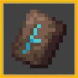

<h1>WELCOME TO TRIMABILITIES!</h1>
</img>
<h3>What is TrimAbilities?</h3>

Trimabilities is a Minecraft datapack designed for Minecraft 1.20.4. It gives the various trims in Minecraft different abilities, including tiered progression and fully custom trims!

<h3>What is planned?!</h3>

We plan to update this pack to the latest version of Minecraft, so hopefully we can add more features!

